

  <h1>Framework Based Programming - EF234501 (2025)</h1>

  <b>Institut Teknologi Sepuluh Nopember</b> 
  Sepuluh Nopember Institute of Technology

  

This project is a personal blog website application developed using Laravel as part of the Assignments for the Framework Based Programming class. This web application is created by <a href="https://github.com/aleahfaa">Iffa Amalia Sabrina</a>.

On behalf of:

**Agus Budi Raharjo, S.Kom., M.Kom., Ph.D.**

---

## Logs
### Week-2
I created the new pages in views also adding all new pages to route (web.php), so the new pages can be accessed. For the blog-detail page, I use route wildcard and `{id}` is the wildcard that I use. Below are the preview of the pages I have created.
1. Home Page
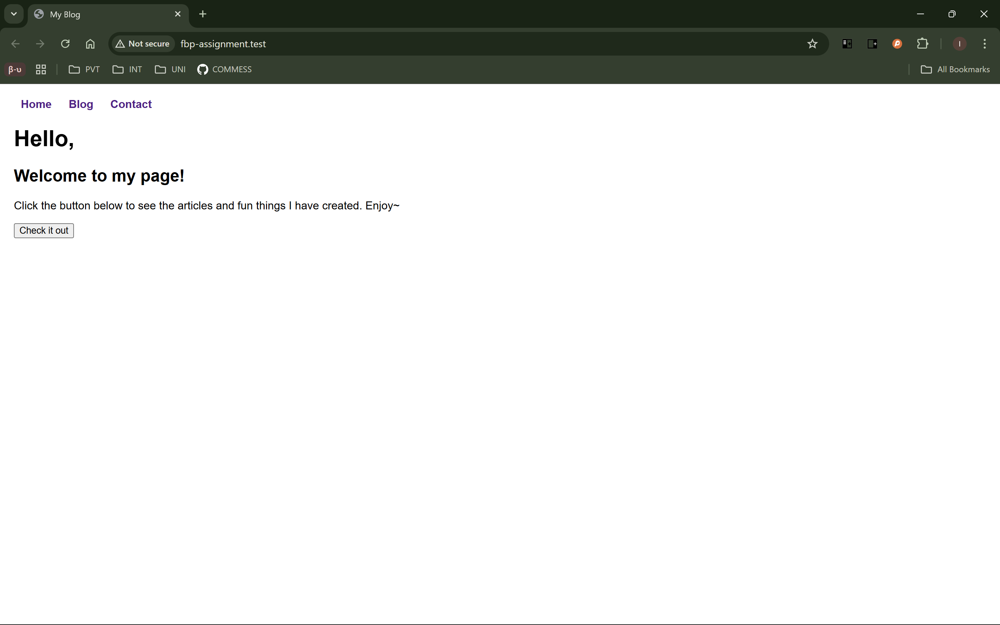
2. Blog Page
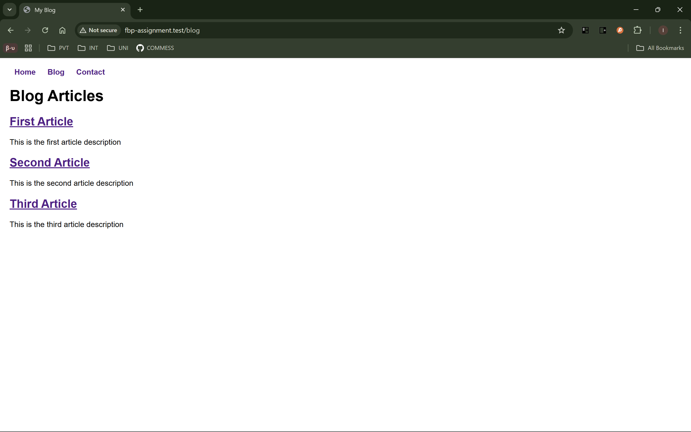
3. Blog Detail Page
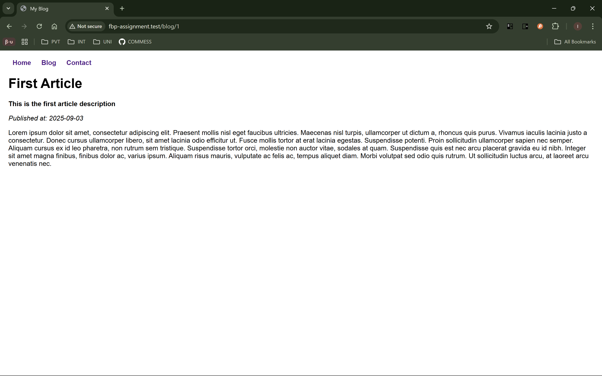
4. Contact Page
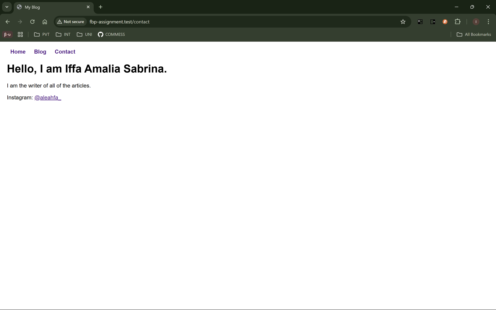
### Week-3
I add components architecture and Tailwind CSS to make it more maintainable and upgrade the design system. Previously, I use the inline HTML in blade files and right now in my code there are reusable Blade components (`x-card`, `x-icon`, `x-navigation`, `x-article-meta`). Below are the preview of the pages with upgraded design system that I have created.
1. Home Page
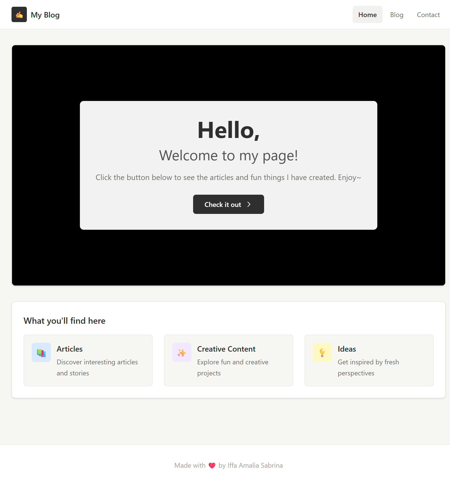
2. Blog Page
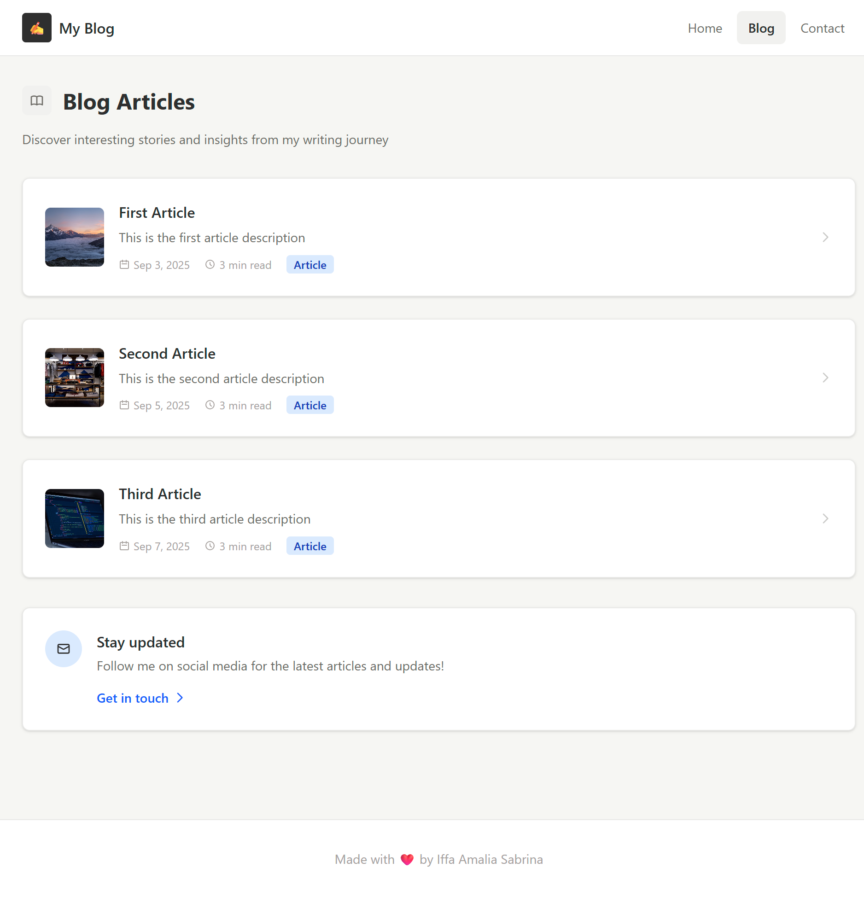
3. Blog Detail Page
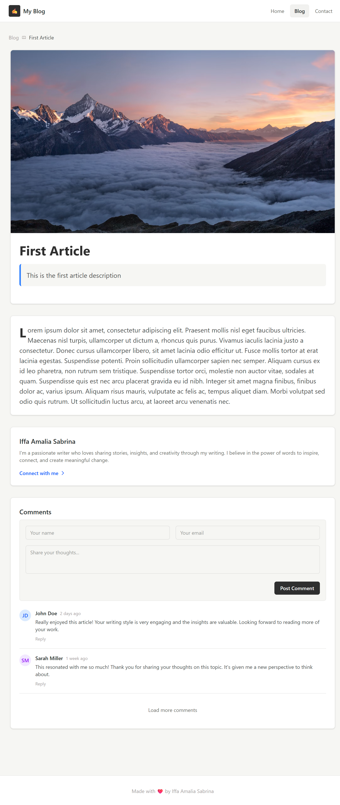
4. Contact Page
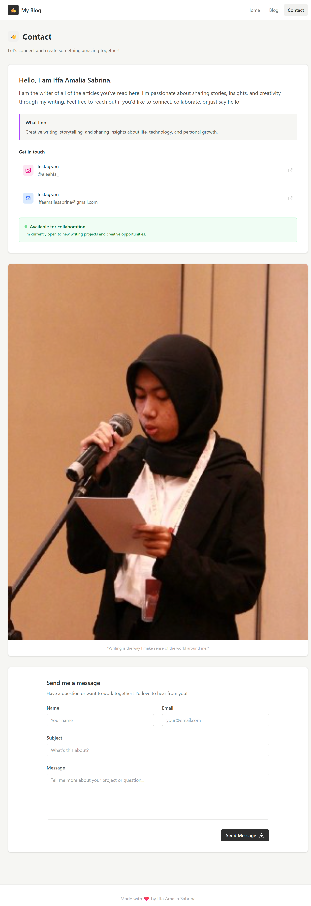  
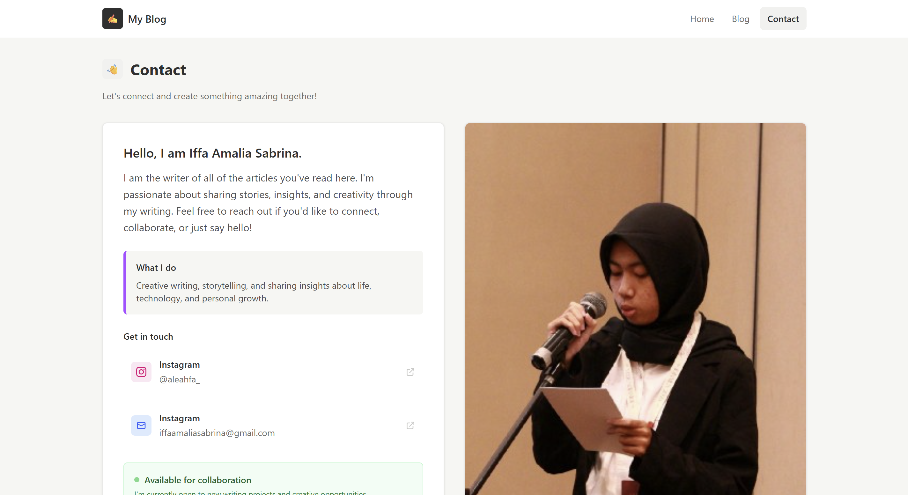  
### Week-4
I add database migrations, models, factories, and seeders. In migrations, I define several columns, such as id, title, description, published_at, image, and content, for articles table. In models, I make the title, description, image, and content table as fillable and I also set the date in timestamp of created_at and updated_at to be the date in published_at. In factory, I generate 10 fake data for testing. The seeder, I use to populate the database use factories. I also change the route of the blog and blog detail so it will take the data from the database. Below are the documentation and the preview of the article pages with fake data in database:
1. Migration
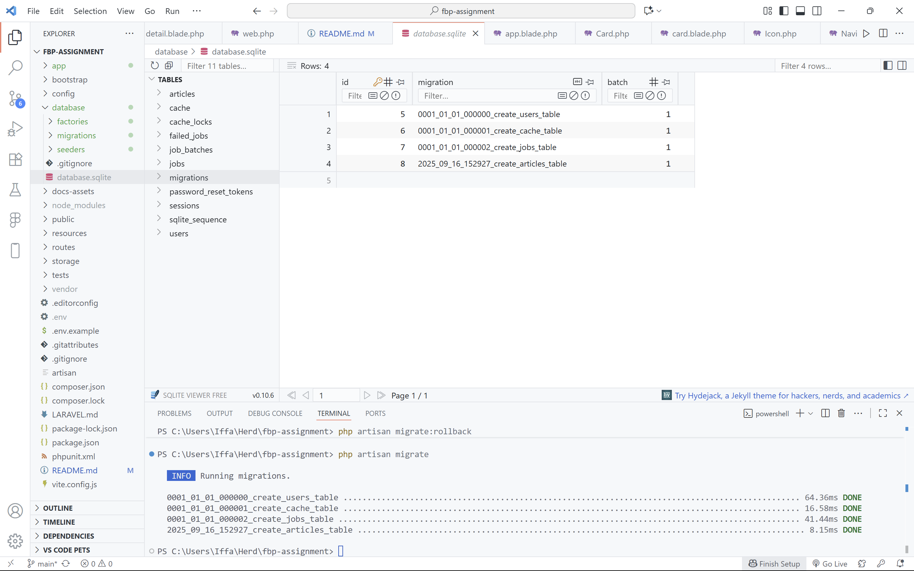
2. Seeders
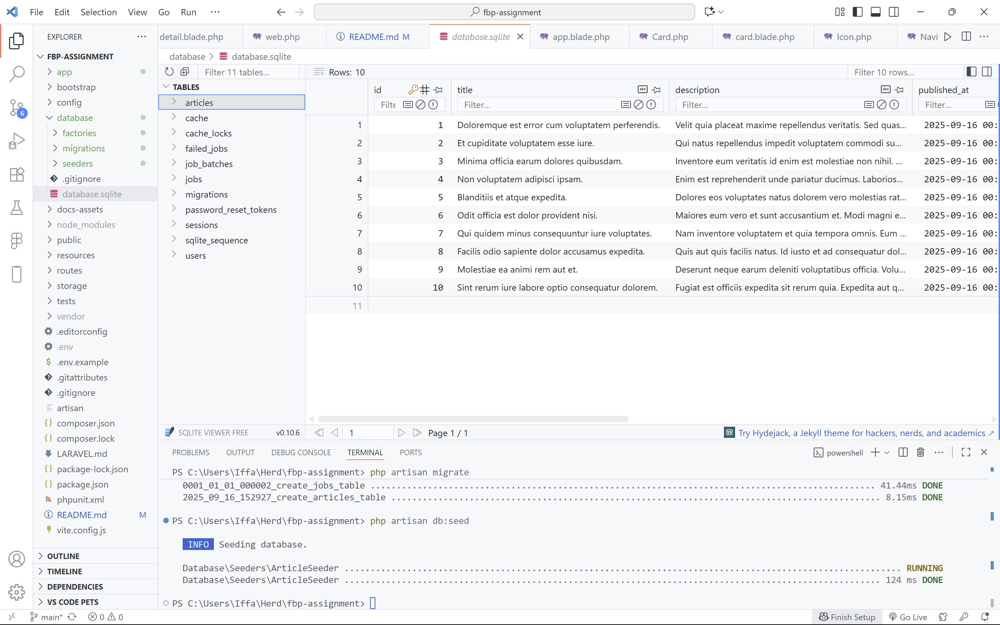
3. Blog Page
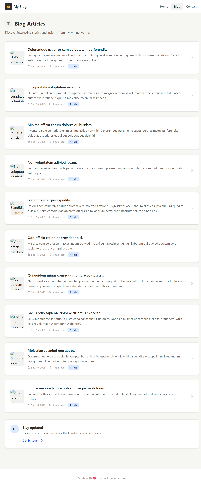
4. Blog Detail Page
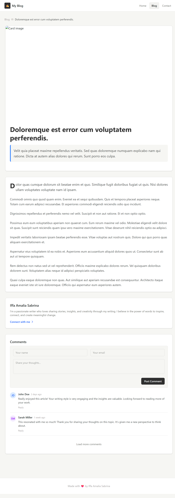
### Week-5
I add controller, named routes, and pagination. Controller is to manage the flow of data between `Models` and `Views` and keep the routes clean and readable. Named routes is to makes route reference flexible, so if the URL change we only need to update the route definition. Pagination is to splits large datasets into pages. Below is the preview of the blog or article page with pagination:
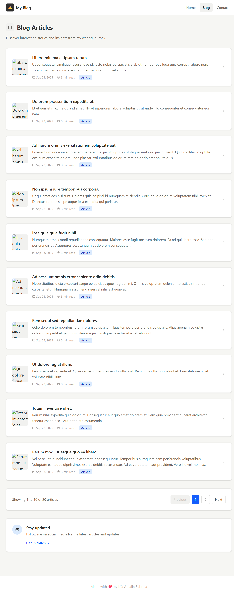

## Tech Stack
- HTML
- PHP
- Laravel
- CSS
- Tailwind CSS
- JavaScript
- SQLite

## Acknowledgements
Thanks to [Net Ninja](https://www.youtube.com/@NetNinja), I can complete this project by following the tutorial in [this playlist](https://youtube.com/playlist?list=PL4cUxeGkcC9gF5Gez17eHcDIxrpVSBuVt&si=xobMN30LE_HB06g_)